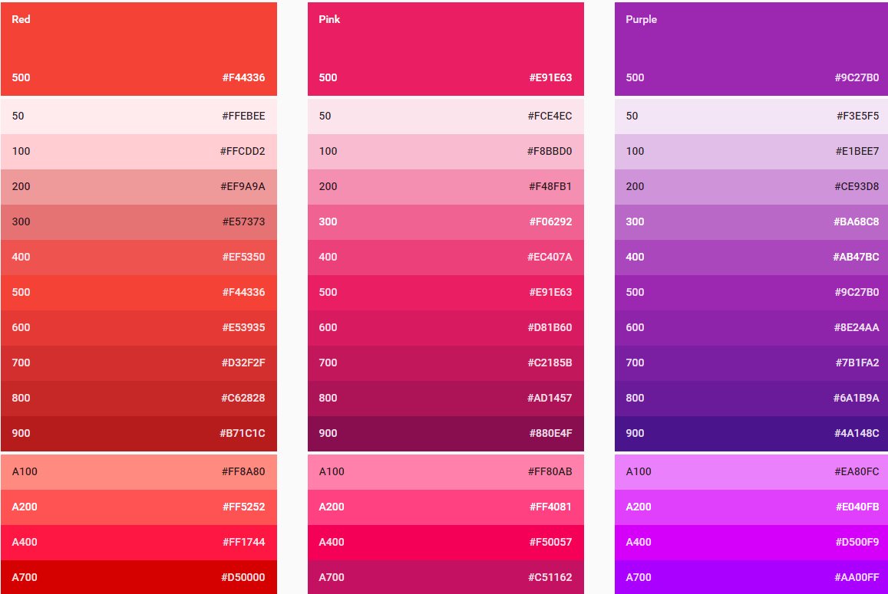

[  ](https://bintray.com/muyangmin/MaterialDesign/md-colors/_latestVersion)
# MaterialDesignColorPalette

This is a clean repo for material design palette colors defined in [Google Design Color 
Palette Reference](http://www.google.com/design/spec/style/color.html#color-color-palette).

##How to use it
You can simply import this via gradle:  
```Groovy  
compile 'org.mym.material:md-colors:1.0.0'
```

If you don't want to add a dependency, you can just copy the `res/values/colors.xml` file and add 
it into your own project.

## Sample Colors
Colors were defined by name pattern **"md_XXX_YYY"**, while XXX means color type, YYY means the level.
For example, for the following color:  
  
These colors were defined as following:  
```XML  

    <color name="md_red_50">#FFEBEE</color>
    <color name="md_red_100">#FFCDD2</color>
    <color name="md_red_200">#EF9A9A</color>
    <color name="md_red_300">#E57373</color>
    <color name="md_red_400">#EF5350</color>
    <color name="md_red_500">#F44336</color>
    <color name="md_red_600">#E53935</color>
    <color name="md_red_700">#D32F2F</color>
    <color name="md_red_800">#C62828</color>
    <color name="md_red_900">#B71C1C</color>
    <color name="md_red_A100">#FF8A80</color>
    <color name="md_red_A200">#FF5252</color>
    <color name="md_red_A400">#FF1744</color>
    <color name="md_red_A700">#D50000</color>

    <color name="md_pink_50">#FCE4EC</color>
    <color name="md_pink_100">#F8BBD0</color>
    <color name="md_pink_200">#F48FB1</color>
    <color name="md_pink_300">#F06292</color>
    <color name="md_pink_400">#EC407A</color>
    <color name="md_pink_500">#E91E63</color>
    <color name="md_pink_600">#D81B60</color>
    <color name="md_pink_700">#C2185B</color>
    <color name="md_pink_800">#AD1457</color>
    <color name="md_pink_900">#880E4F</color>
    <color name="md_pink_A100">#FF80AB</color>
    <color name="md_pink_A200">#FF4081</color>
    <color name="md_pink_A400">#F50057</color>
    <color name="md_pink_A700">#C51162</color>

    <color name="md_purple_50">#F3E5F5</color>
    <color name="md_purple_100">#E1BEE7</color>
    <color name="md_purple_200">#CE93D8</color>
    <color name="md_purple_300">#BA68C8</color>
    <color name="md_purple_400">#AB47BC</color>
    <color name="md_purple_500">#9C27B0</color>
    <color name="md_purple_600">#8E24AA</color>
    <color name="md_purple_700">#7B1FA2</color>
    <color name="md_purple_800">#6A1B9A</color>
    <color name="md_purple_900">#4A148C</color>
    <color name="md_purple_A100">#EA80FC</color>
    <color name="md_purple_A200">#E040FB</color>
    <color name="md_purple_A400">#D500F9</color>
    <color name="md_purple_A700">#AA00FF</color>
```

Hope you enjoy it !